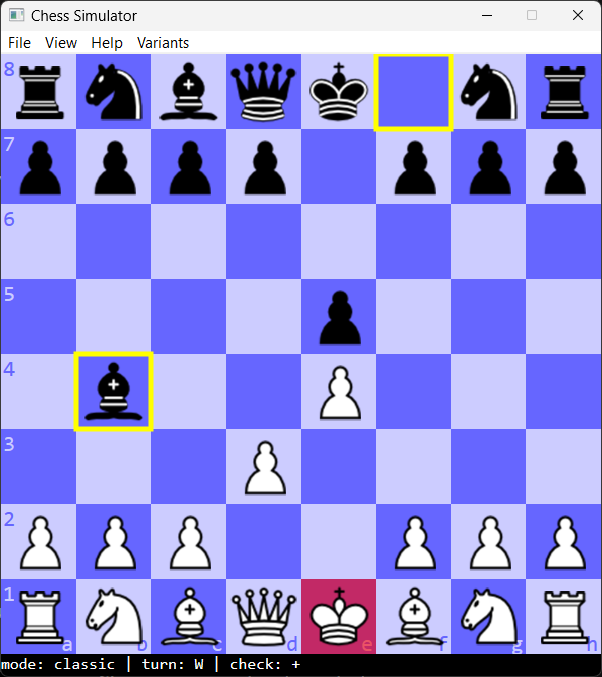
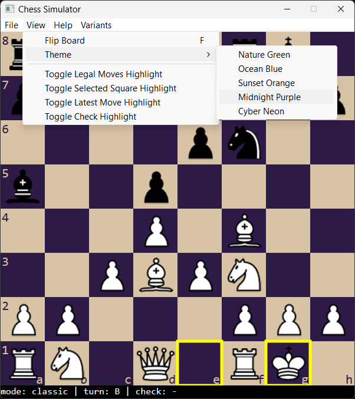

# Chess Simulator

A desktop Chess Simulator built using **C++**, **Win32 API**, and **DirectX2D**.

This project was my first serious attempt at building a complete board game engine from scratch.  
It focuses on low-level rendering, input handling, board state management, and chess rule implementation without relying on external game engines.

The project was later rewritten with a cleaner architecture and improved rendering pipeline, but this repository represents the original implementation and learning process.

---

## Features

- Interactive chessboard rendering using DirectX2D
- Mouse-based piece movement
- Legal move validation
- Turn-based gameplay
- Check and checkmate detection
- Piece highlighting and move visualization
- Custom board and rendering logic
- Win32 event/message loop handling

---

## Tech Stack

- **Language:** C++
- **Graphics:** DirectX2D
- **Windowing:** Win32 API
- **Build System:** Visual Studio

---

## Screenshots





---

## Architecture Overview

The project is divided into several core systems:

### Rendering System
Handles:
- Board rendering
- Piece drawing
- UI overlays
- Highlight effects

Built directly on top of DirectX2D.

### Game Logic
Responsible for:
- Piece movement rules
- Turn management
- Collision and move legality
- Check/checkmate evaluation

### Input System
Processes:
- Mouse clicks
- Piece selection
- Drag/drop interactions
- Win32 messages

---

## Learning Goals

This project was created to explore:

- Low-level graphics programming
- Real-time rendering concepts
- Win32 application development
- Game loop architecture
- Chess engine fundamentals
- Data-oriented thinking in C++

It was also an important stepping stone toward later projects involving:
- compute shaders
- ray tracing
- engine architecture
- GPU programming

---

## Building the Project

### Requirements

- Windows
- Visual Studio 2022 (recommended)
- DirectX SDK / Windows SDK

### Build Steps

1. Clone the repository

```bash
git clone https://github.com/TejasKayande/Chess-Simulator.git
```

2. Open the `.sln` file in Visual Studio

3. Build and run in `Debug` or `Release` mode

---

## Future Improvements

- Chess AI using Minimax
- Bitboard representation
- PGN/FEN support
- Move history
- Animations
- Better UI scaling
- Engine/UI separation

---

## Why This Project Matters

Most chess projects focus purely on gameplay logic.

This project was intentionally built closer to a lightweight game engine approach:
- manual rendering
- native Windows APIs
- custom event handling
- explicit graphics pipeline usage

The goal was not just to make chess playable, but to understand how desktop rendering and game architecture work at a lower level.

---

## Related Projects

- Raytracer using compute shaders
- Graphics programming experiments
- Engine architecture prototypes

You can find more projects on my GitHub profile:
<YOUR_GITHUB_PROFILE>

---

## License

MIT License
